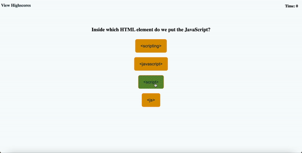

# code-quiz

## Description
This repo consists of web application that lets user to test their knowledge on their coding skill. This app runs in the browser and dynamically updates HTML and CSS via Javascript.

## User Story
```
AS A coding boot camp student
I WANT to take a timed quiz on JavaScript fundamentals that stores high scores
SO THAT I can gauge my progress compared to my peers
```

## Acceptance Criteria

```
GIVEN I am taking a code quiz
WHEN I click the start button
THEN a timer starts and I am presented with a question
WHEN I answer a question
THEN I am presented with another question
WHEN I answer a question incorrectly
THEN time is subtracted from the clock
WHEN all questions are answered or the timer reaches 0
THEN the game is over
WHEN the game is over
THEN I can save my initials and my score
```

## Features
This password generator application includes the following features:
- The user can click the "Start" button to start the quiz
- The user is prompted with series of questions with multiple choices 
- The user is timed as they answer the question
- The timer is decreased by 15 seconds everytime they select the wrong answer
- The user can submit their score with initials
- The user can see the list of submitted scores
- The user can restart the game and clear the scores

## Mock-Up
The following GIF displays the web application's appearance and functionality:



## Review
To review the refactored code, please go to the [repository](https://github.com/sistaniabong/code-quiz)

## Deploy
To deploy this web application, please click on this [link](https://sistaniabong.github.io/code-quiz/)
